Blog Post for Human-Aligned Chess

By Andrei Todiraș

Introduction

In the last few years, chess has absolutely boomed. It feels like it\'s
everywhere right now, whether in the train, in the parc, even in the
lecture hall, there are people playing chess on their phones. The number
of tournaments, movies, TV shows, learning material etc. has increased
exponentially since the pandemic, even though this game has existed for
centuries. There are over 10 million people logging in every day and
playing an online game. This means an\
enormous amount of games, being played by all types of people (be they
professionals, players who don\'t even know the rules, 5 year-olds, 95
year-olds and everything in between) are recorded and stored in
databases, along with all sorts of metadata (players\' ELO ratings,
nationality, time format etc.). To put it in short: a simple,
deterministic, fully observable game with an insane amount of well
organized data. For any AI enthusiast, this is Heaven!

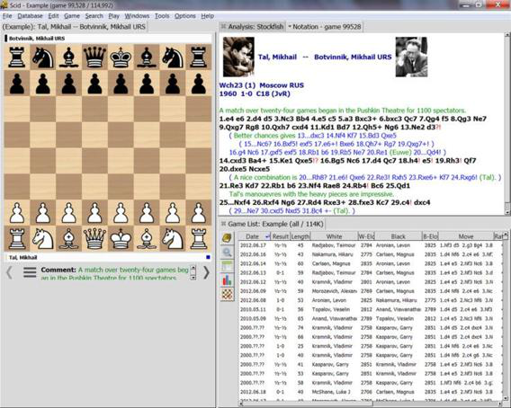{width="5.133333333333334in"
height="4.1055544619422575in"}

1 Andrei Todiraș 31.07.2025

https://painedeorz.github.io/posts/2025/05/Human-Aligned-Chess/

Of course, the fact that chess is a great environment to develop
algorithms has been known ever since computers were created. Alan Turing
himself created an algorithm even before computers were advanced enough
to run it. The 70\'s and 80\'s saw the creation of computers built
specifically for chess (also called engines), despite massive costs,
culminating with IBM\'s DeepBlue, a multi-million dollar project that
ultimately defeated world champion at the time (1997) and arguably
greatest chess player of all time, Garry Kasparov. After this legendary
moment, investing in chess engines increased exponentially, and today we
have computers that can easily defeat the best players even without a
whole lot of processing power.

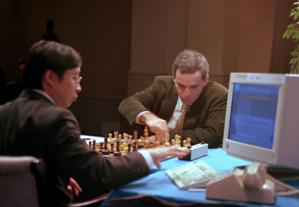{width="3.116665573053368in"
height="2.158333333333333in"}

(Kasparov vs. DeepBlue 1997. Source:

However, the world of chess isn\'t without its problems. Cheating, in
particular, is probably the greatest one. Another one is the very
inefficient learning process that consists of analyzing one's own games
with an engine. The problem here lies in the fact that an engine only
gives moves, not explanations. Sometimes, these moves are simply
ridiculous, especially for a beginner, though many times even for the
best players in the world. Thus, the "learner" can't actually learn
anything and ends up just moving on to the next game. An ideal solution
to this problem would be an engine that emulates players of certain
levels, and thus can recommend a good move (even though it may not be
quite the best) that the player can understand and be able to find.
Combine such an engine with something like a ChatGPT to create
explanations to the move, and then we can talk of a genuine chess
trainer!

Both of these, as well as many other problems in the world of chess,
start, unfortunately, with an ambiguous concept: \"human\", or
\"natural\" moves. What makes a move \"natural\", so that our trainer
could recommend it? What makes a move \"unnatural\", so that we can
detect it as a form of cheating? These are the kind of questions we are
going to take the first step into answering in this blogpost, by seeing
how to create a \"human-aligned engine\" that can predict not the best
move in a position, but the most \"human\" one.

2 Andrei Todiraș 31.07.2025

https://painedeorz.github.io/posts/2025/05/Human-Aligned-Chess/

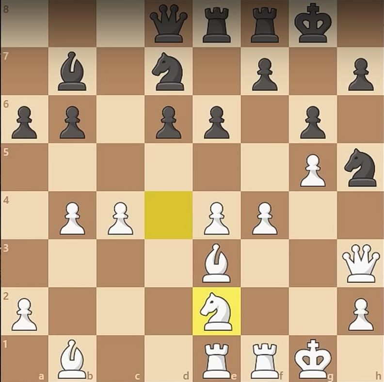{width="3.9625in"
height="3.9499989063867016in"}

(Example of "unnatural" move. Black to move, best move: a5, despite
incoming attack on the king. Source:

Modern Chess Engines

In order to understand how to create a \"human-aligned engine\", first
we need to dive into the workings of a \"normal\" engine. Ever since the
launch of AlphaZero, an engine developed by Google in 2017 with a
revolutionary neural network-based approach, the trend has been the
same: A really complex, feed-forward neural network with lots of layers,
training on self play (playing millions or even billions of games
against itself) to create an evaluation function, based on which an
iterative deepening Monte-Carlo Tree Search (in short MCTS) is run. The
more time and processing power available, the better the tree search
could be, though limited by the neural network (which however complex
cannot be perfect).

The reason why this approach was revolutionary was, first and foremost,
because the style of play of AlphaZero seemed closer to that of humans
than Stockfish, the best engine at that time (and now as well).
AlphaZero was aggressive, came up with interesting patterns that the
best players in the world have started implementing in their own games,
and sparked massive enthusiasm in the tech community. Why? Conceptually,
chess is a great AI application, due to its simple nature.
Clearly-established algorithms such as alpha-beta pruning are,
intuitively, the

3 Andrei Todiraș 31.07.2025

https://painedeorz.github.io/posts/2025/05/Human-Aligned-Chess/

way is should be solved (if chess could ever be solved). It is hard to
understand why a machine learning model (a neural network) would be any
better. After all, we don't need a model that can generalize, we don't
even need an engine that is extremely efficient. A chess engine outputs
the best move in a singular, clear, given position, and that is all. Of
course, the fantastic results of AlphaZero lie behind the complexity of
the neural network, crafted by ML experts at Google with the help of
chess experts, but still, this method was very surprising at first.

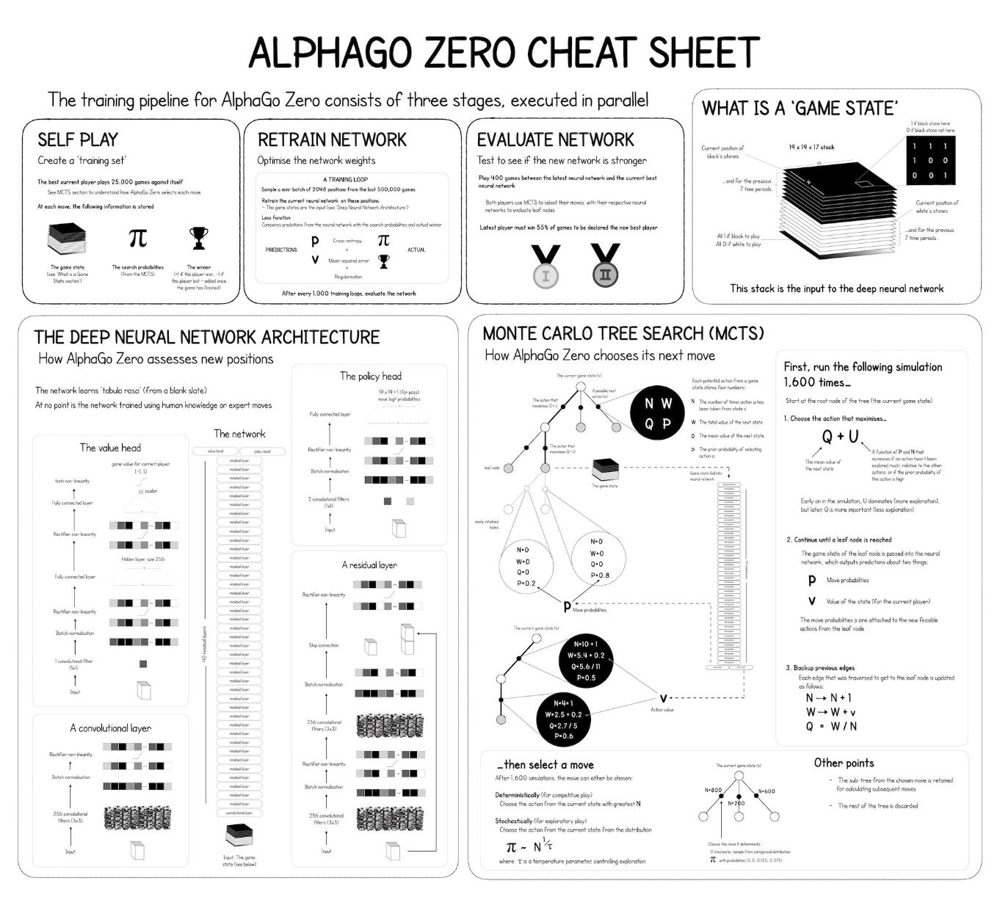{width="6.170832239720035in"
height="5.554166666666666in"}

(Basic Structure of AlphaZero. Source:

There is still a limitation of using machine learning algorithms (based
on lots of data rather than ground truths) instead of more simple AI
ones. A famous example for it is Plaskett\'s puzzle, a study that puts
white in a completely winning position, with forced checkmate in 14
moves,

4 Andrei Todiraș 31.07.2025

https://painedeorz.github.io/posts/2025/05/Human-Aligned-Chess/

which LeeLa, a continuation of the AlphaZero concept, doesn\'t find. The
seemingly more basic Stockfish (alpha-beta pruning with lots of
hand-crafted heuristics), however, does find it, albeit after a very
long time in the world of computers. The puzzle was presented to the
best players in the world at a tournament in Brussels in 1987. Kasparov
and Karpov were among the ones who couldn't find the solution, only
Mikhail Tal did.

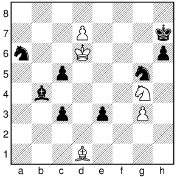{width="3.0833333333333335in"
height="3.0416666666666665in"}

(Plaskett's puzzle. Leela evaluation: black is better. Stockfish depth
30 (after 1 min 17s) says black is better. Stockfish depth 40 (18:06):
white is winning.

Source:Chess AI: Competing Paradigms for Machine Intelligence (Shiva
Maharaj, Nick Polson, Alex Turk) 2021)

Today, though, even Stockfish has moved towards the neural network
approach, which we are also going to use for our \"human-aligned\"
engines, albeit for more obvious reasons.

Human-Aligned Engines - a First Attempt

The first question one might have when talking about designing a
human-level engine is as follows: If we already have Stockfish or Leela
which are much better than any human, why can\'t we simply cut a lot of
their processing power, or limit the depth of their search tree, until
they are just as weak as us? Well, here is where the concept of
\"human\" moves comes into play. Humans, whether they are complete
beginners, amateurs or advanced players, don\'t just play random bad
moves. They play certain bad moves. There is always some thought process
going

5 Andrei Todiraș 31.07.2025

https://painedeorz.github.io/posts/2025/05/Human-Aligned-Chess/

into a move, sometimes erroneous for hidden reasons, such as missing an
insane tactic 10 moves into a variation, sometimes for obvious reasons,
such as blundering a queen in one move. Some moves are extremely
intuitive, what we call \"natural\", even though an engine may deem it a
blunder.

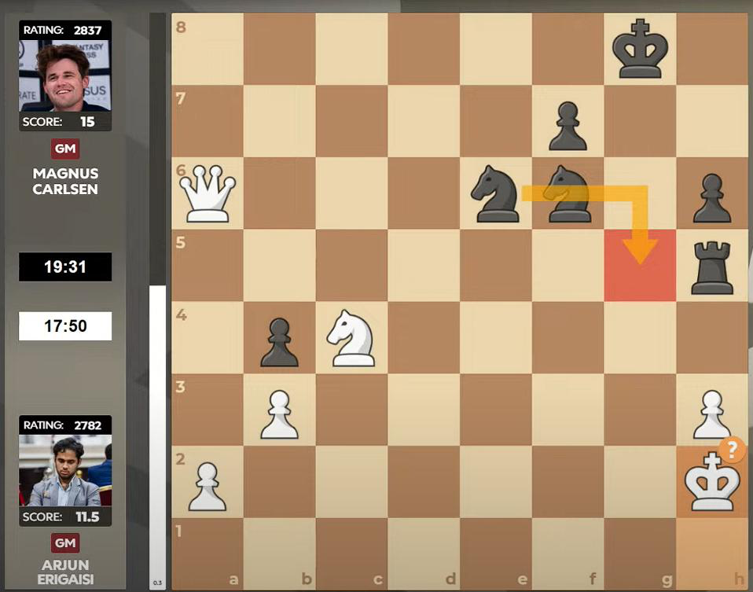{width="4.35in"
height="3.4180555555555556in"}

In order to understand a little bit more clearly what an \"unnatural\"
move is, let\'s take an example. In the position above, the best player
in the world, Magnus Carlsen, has a rook and a knight for the
opponent\'s queen, which is already disadvantageous. Stockfish thinks
that the only way to draw the game (which is the best result Magnus can
hope for here), is to sacrifice a knight, though not for immediate
tactical purposes (even Stockfish doesn\'t find a forced sequence
leading to the draw). Despite having more than 20 minutes to think,
Magnus doesn\'t find the move, and the commentators don\'t even blame
him, because that engine\
recommendation is simply \"unnatural\".

Just toning down existing engines doesn\'t emulate human play, it just
leads to either random bad moves or accidental best moves, so we have to
come up with smarter methods.

6 Andrei Todiraș 31.07.2025

https://painedeorz.github.io/posts/2025/05/Human-Aligned-Chess/

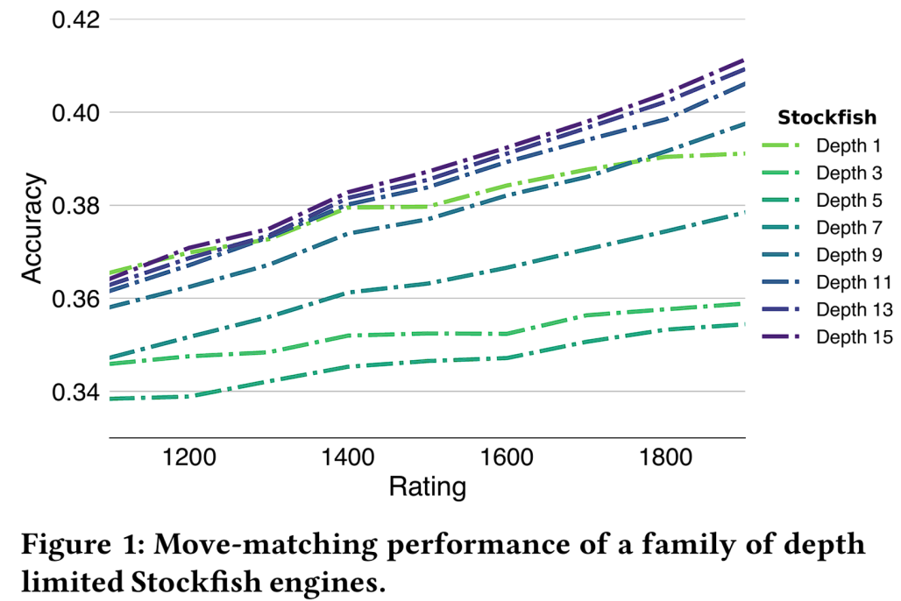{width="5.1402777777777775in"
height="3.433333333333333in"}

(Depth-limited versions of Stockfish leading to low accuracy scores.
Source: \[1\])

MAIA

MAIA, the first \"human-aligned\" engine, was created with a very simple
idea in mind. Taking exactly the model of LeeLa, but instead of training
the neural network with self-played games (which are good to find the
best move because they investigate many moves), train it with human
games. We have already talked about there being billions of games nicely
recorded in databases, so we have more than enough data to train the
neural network. Of course, when we talk about human-level play, it is
very important to distinguish between a 5 year old beginner playing a
game in the park and Magnus Carlsen playing in a tournament, but we
already have the tools to differentiate the two: ELO. This is a system
that separates people based on their strength, and it does the job
really well (it has been used for more than 50 years). So MAIA is not
actually one engine, it is a family of nine different ones, each working
exactly in the same way, but the neural network is trained on games
between players of different rating ranges.

7 Andrei Todiraș 31.07.2025

> https://painedeorz.github.io/posts/2025/05/Human-Aligned-Chess/

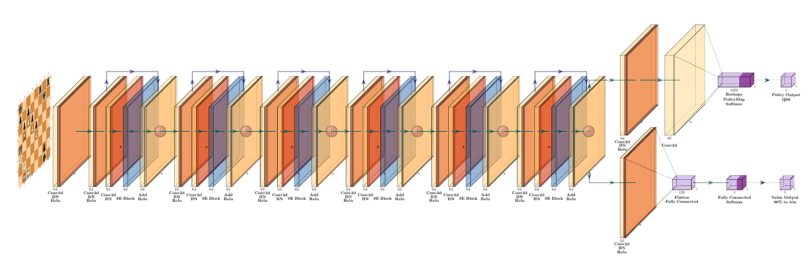{width="8.068055555555556in"
height="2.6041666666666665in"}

> (MAIA's neural network in detail. Source: \[1\])
>
> The rather unintuitive change that MAIA brings, however, is a lack of
> a MCTS following the training of the neural network. This is a purely
> ad-hoc finding. As the following graph portrays, the results are
> simply a bit better when the neural network alone predicts the move.
> This is quite surprising. There are two main reasons for it: (1) MAIA
> only focuses on amateur-level games (under 2000); (2) the authors only
> used a fixed depth MCTS (which becomes relevant when we talk about
> ALLIE).
>
> 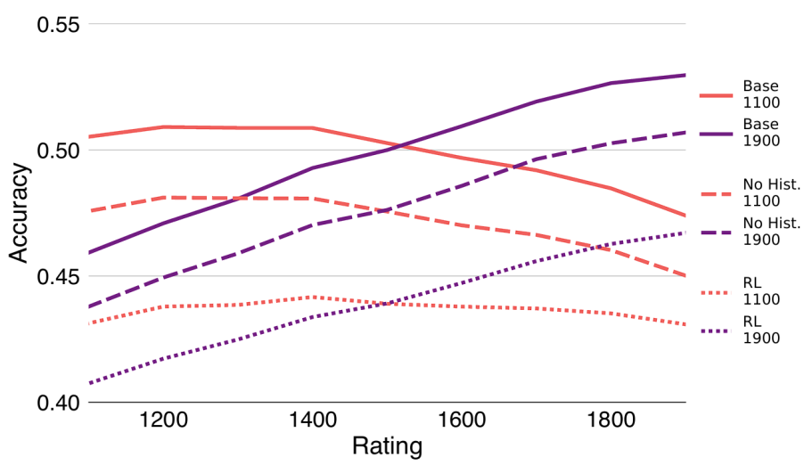{width="4.512498906386702in"
> height="2.6124989063867017in"}
>
> (MCTS leading to lower accuracy than pure NN output. Source: \[1\])
>
> Apart from this peculiarity, there is not much else to say about
> MAIA\'s implementation. Much more interesting, however, are the
> results. We can see an accuracy a little over 50%, which intuitively
> sounds quite poor, but let\'s analyze what this accuracy actually
> means. Normally in chess, when we talk about accuracy, we compare
> human play against the engine. Thus, 100%
>
> 8 Andrei Todiraș 31.07.2025

https://painedeorz.github.io/posts/2025/05/Human-Aligned-Chess/

accuracy means playing all the best moves recommended by the computer,
and any other moves at any point decrease that accuracy, some by a lot
(blunders), other by a little (slight mistakes or just alternatives to
the best moves). In our case here, it is a little bit differently.
Because we don\'t actually measure how \"human\" each move is, we cannot
objectively measure whether a predicted move is good for us or not.
Instead, all we have is already played games, and we either predict the
move played in the game used for testing, or we don\'t. This means that
a rather low accuracy score is very much normal, because in a position
there can be multiple different \"human\" moves, but only one is tested.
As such, using only the accuracy metric is clearly not enough for
evaluating our engine.

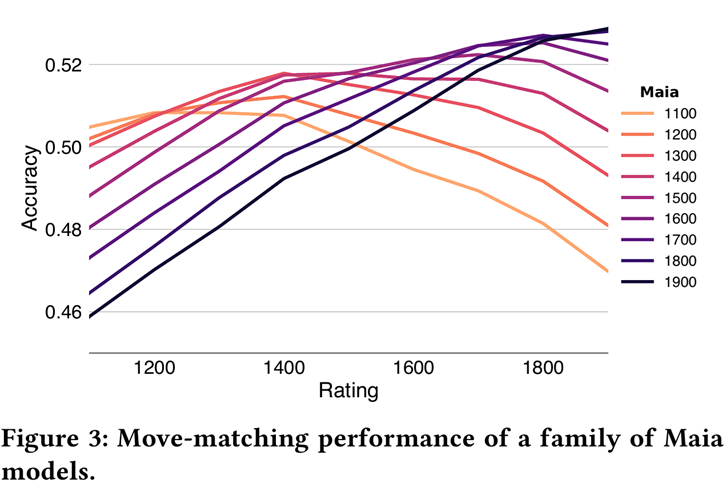{width="5.8125in"
height="3.8986111111111112in"}

(Accuracy scores of all MAIA models. Source: \[1\])

Instead, by far the best analysis of a human-aligned engine is, of
course, a Turing test. After all, if humans playing against the engine
cannot tell that their opponent is not human, our goal is accomplished.
That is, all in all, as human as it gets. For the Turing test we go to a
different paper, and the results are really quite astounding. Humans
were paired against other humans, MAIA, and a toned-down version of
Stockfish, then asked to rate their confidence in whether their opponent
was human or not. While Stockfish was clearly recognized, MAIA wasn't.
The difference between playing a human opponent and MAIA is very small,
which shows that the

9 Andrei Todiraș 31.07.2025

https://painedeorz.github.io/posts/2025/05/Human-Aligned-Chess/

accuracy metric should be taken with a grain of salt. Of course, the
higher the better, that is why we\'ll be taking a look at an even better
engine next, but these results are already very good.

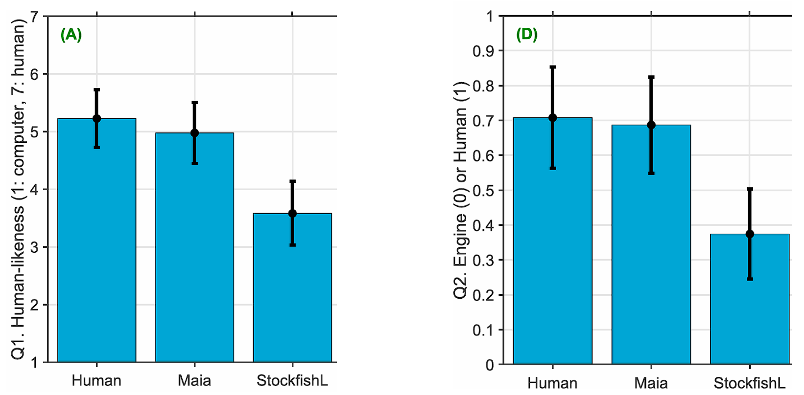{width="6.5in"
height="3.198611111111111in"}

(Results of the Turing test. Source: Eisma, Yke Bauke, Robin Koerts, and
Joost de Winter. \"Turing tests in chess: An experiment revealing the
role of human subjectivity.\" *Computers in Human Behavior Reports* 16
(2024): 100496)

ALLIE

The authors of ALLIE change their approach in accomplishing the same
task and they come up with a model that is quite a lot more complex.
Firstly, its structure is inherently different. It takes as input a
whole game played until a certain position (including the game\'s time
control and the time used for each move) instead of just a position. As
output, it outputs a move and a value head, just like MAIA, but also
predicts a pondering time, that is, how long the engine is going to
\"think\" on the next move.

This pondering time doesn\'t just make the engine more realistic, but
serves as the basis of balancing the Monte-Carlo Tree Search. This is
the second main difference to MAIA. The authors of MAIA found that MCTS
led to worse results, in particular for amateur-level games. The mention
that they only tried the AlphaZero-inspired iterative-deepening MCTS
plays a crucial role here. What ALLIE does is quite different, in that
the MCTS is restricted not in depth, but in time. The MCTS runs for only
as long as the predicted pondering time allows, albeit as deep as it
wants to.

10 Andrei Todiraș 31.07.2025

> https://painedeorz.github.io/posts/2025/05/Human-Aligned-Chess/
>
> In a way, this is also a more intuitive approach. When we think of how
> humans analyze a position, what was calculated on the previous moves
> matters a lot (humans think in sequences of moves, not analyzing a
> position the same way every single move), and when humans calculate
> future sequences, they go very deep (up to 15-20 moves) in forcing
> variations (attacks on the enemy king, forced checkmates or lots of
> trades), but often disregard other moves even after just seeing the
> immediate response of the opponent. As such, an uneven search tree is
> normal for a human brain.

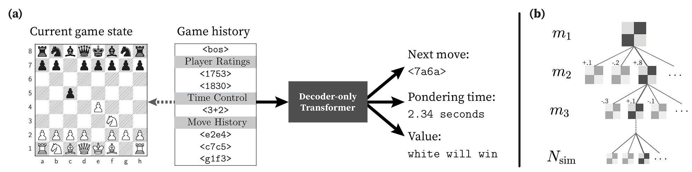{width="8.4375in"
height="2.102777777777778in"}

> (ALLIE's structure. Source: \[2\])
>
> Because we are using the whole metadata of a game instead of just a
> given position, we can now change the way we use the neural network as
> well. Instead of a very complex feed-forward neural network, the
> authors of ALLIE used a GPT 2.5 - style recurrent neural network. The
> point is that we can think of a game of chess as a sentence. We make
> the next move depending on the moves we have played before (based on
> calculations that we have made before), just like modern LLMs predict
> the next word in a sentence based on all the words written before. The
> same applies to the pondering time. If in a rapid game, we spent 5
> minutes thinking on a move, we are not going to spend another 5
> minutes on the next one.
>
> All this is helped massively by the way in which chess games are
> stored, that is PGNs. These are very nicely formatted text files that
> are automatically readable through the use of already-existing
> libraries, so splitting the input games into each of the moves and the
> time spent on each one is a simple automated process. Otherwise, one
> can imagine how impossibly tedious it would be.
>
> 11 Andrei Todiraș 31.07.2025
>
> https://painedeorz.github.io/posts/2025/05/Human-Aligned-Chess/
>
> 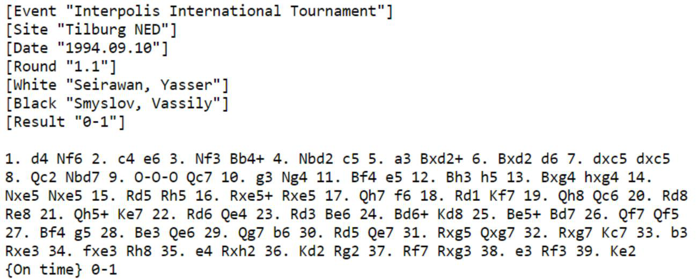{width="6.5in"
> height="2.613888888888889in"}
>
> (Example of a PGN file. Source:
>
> But if MAIA already had great results in the Turing test, how much
> better can ALLIE really be, given that it uses truly state-of-the-art
> methods in AI and ML? Well, the accuracy score, while not particularly
> relevant in absolute terms, is still a great comparison between the
> two engines.
>
> After all, the higher the accuracy, the better. Remember that the
> difference between a toned-down version of Stockfish and MAIA,
> although massive in the Turing test, was about 10-15% in accuracy
> score. What about ALLIE?

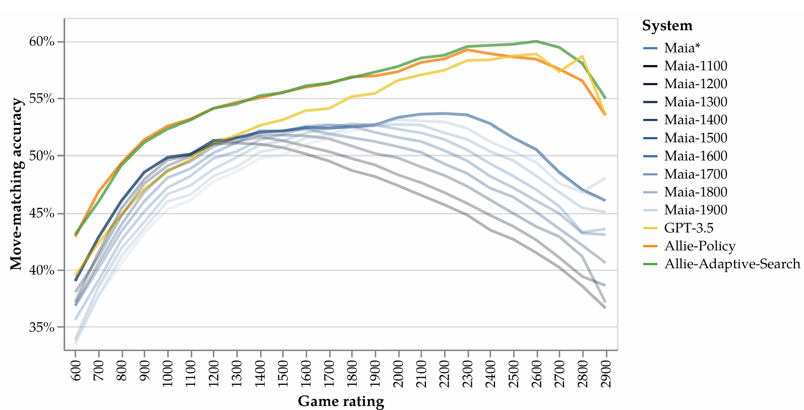{width="7.252777777777778in"
height="3.7in"}

> (Comparison of accuracy between ALLIE and MAIA models. Source: \[2\])
>
> 12 Andrei Todiraș 31.07.2025

https://painedeorz.github.io/posts/2025/05/Human-Aligned-Chess/

Well, at the amateur levels (where the authors of MAIA particularly
focused), the difference is not particularly significant (under 5%).
However, as we go up in rating, and especially as we hit the 2000 rating
mark (which is about where more advanced-level games begin), a massive
improvement can be seen. This is the power of the MCTS. Getting up to
even 60% accuracy at the 2600 rating, there is a bigger difference
between ALLIE and MAIA than between MAIA and the bad version of
Stockfish in some rating ranges.

These results can also be seen on the Turing test, though here the
difference cannot be particularly large. Such few people were able to
distinguish between ALLIE and a human opponent, that we lie withing the
psychological boundaries (some people will intentionally say they played
against an engine simply because they expect it, not because they can
really identify engine-like moves).

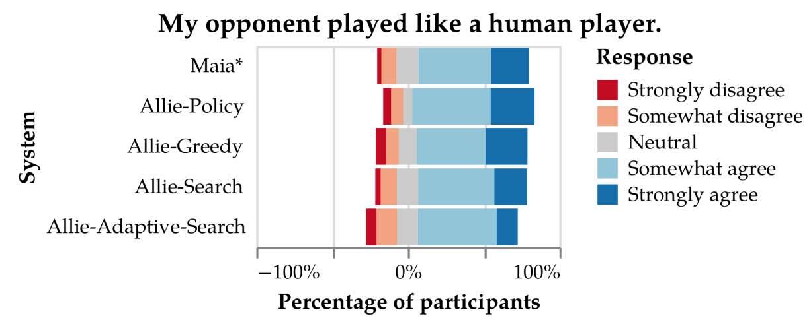{width="6.131944444444445in"
height="2.4277766841644794in"}

(Turing test results on ALLIE. Source: \[2\])

For this reason, we also turn to some qualitative feedback from the
participants in the Turing test. To start with the positives, the time
management was a great psychological factor, it feeling human to play
against someone that spends little time on forcing moves and more time
in more complex positions. What is more, the engine does make mistakes
(that is also our goal), but they aren\'t random bad moves, they feel
human, which is very much what is wanted from the engine.

The most common negative feedback is on its endgame play. This is a very
interesting one. From a machine learning perspective, one can think that
there is a lot less data on endgames than on openings, and also that
endgames are so different from one another that it is very difficult for
the model to generalize well. From a chess player\'s perspective,
however, I can also understand it. As humans, we learn endgames
separately, as though they are their own games and not continuations of
a long game. We learn techniques, abstract concepts and positions that
we

13 Andrei Todiraș 31.07.2025

https://painedeorz.github.io/posts/2025/05/Human-Aligned-Chess/

need to reach in order to force a win or a draw, concepts which a
machine learning model doesn\'t have as input. Also the training data is
extremely faulty, particularly in endgames. Since we are only using
rapid and blitz games, most games that reach the endgame are probably
won on time. Many times it is about the internet speed and mouse skills
rather than pure endgame technique. So one can understand why the model
performs worse in endgames.

Issues with the models

This last issue discussed on ALLIE reveals a greater problem not just
behind the two models I have presented today, but on any model any
person may try to create: the data. When using online games, one has to
realize that their great advantage (the huge number of games) is also
their problem. These games are not particularly serious, at least not
always. The same human will play very differently when actually focusing
for 30 minutes than when drunk at 4 a.m. But there is hardly a way of
finding only serious games. One solution would be to only use tournament
games, but there aren\'t a whole lot of online tournaments, especially
at lower rating levels. And as we have seen, we do need a lot of games
(tens of millions).

Future Possibilities

The engines presented today are, fundamentally, an interesting though
rudimentary approach of emulating human behavior. Despite the methods
used being state-of-the-art when it comes to Machine Learning, they only
rely on the massive amounts of data at our disposal. The techniques,
methods and algorithms have hardly anything to do with chess in
particular. In a way, it is really quite remarkable that they even work
as well as they do. Of course, the more interesting task that comes to
mind when talking about "human-aligned engines" would be to truly
emulate the human thought process in a game of chess, and thus not just
to achieve much better accuracy scores, but to create a machine that
truly thinks on its own. This is, however, a much more complicated task.
First and foremost, an abundance of psychological research into how
chess players of different rating ranges think would be needed. Then, a
strong collaboration between the HCI and ML communities would be
crucial.

But what can be done with the engines presented today? Well, with only
minor adjustments, the engine could output multiple moves instead of
just one, and compare them to a Stockfish evaluation to output a good
(though perhaps not optimal), yet human move in a position. This is
exactly the application we have discussed in the beginning of the
article, the personalized chess trainer.

14 Andrei Todiraș 31.07.2025

https://painedeorz.github.io/posts/2025/05/Human-Aligned-Chess/

Regarding the prospect of using these engines for anti-cheating
purposes, this seems quite difficult. Inherently, the presented engines
don't tackle the question of whether a move is human or not, or try to
quantify how human a move may be. When considering an anti-cheating
application, that would be the main question. One could try to create a
system that compares the played move with what MAIA or ALLIE would have
recommended. A strong dissonance between the two, along with the
statistical data used anyway for anti-cheating measures (such as average
accuracy, typical time consumption or style of play in past games), may
lead to an improvement over current systems.

Conclusion

"Human-alignment" is a recently growing topic in the AI community, with
loads of prospects and future possibilities. Just like widely used AI
algorithms have initially been created for simple applications, such as
the game of chess, it is only natural to start the quest towards
human-aligned computers in such applications as well. The two engines I
described today are simply using already-successful models (LeeLa and
GPT 2.5), with minor adjustments to fit the specific task. Their
results, although far from perfect, are remarkable. In a way, they prove
the power of ML: its applicability to various domains with various
scopes. At the same time, they underline ML's weaknesses: relying on
data that will never be perfect to create models that will also never be
perfect.

I hope, with this blog post, that I've sparked a little bit of interest
to the reader. After all, this was the objective of both papers as well.
If not in the specific task of human-aligned chess engines, then at
least in the general question of computers emulating human behavior. I'm
sure this is a topic that interests many and is only growing in
popularity, and it is small steps like these specific applications that
lead to a more general answer to the problem.

Sources

\[1\] McIlroy-Young, Reid, et al. \"Aligning superhuman ai with human
behavior: Chess as a model system.\" *Proceedings of the 26th ACM SIGKDD
International Conference on Knowledge Discovery & Data Mining*. 2020

\[2\] Zhang, Yiming, et al. \"Human-aligned chess with a bit of
search.\" *arXiv preprint arXiv:2410.03893* (2024).

15 Andrei Todiraș 31.07.2025
